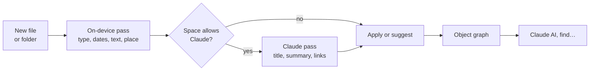
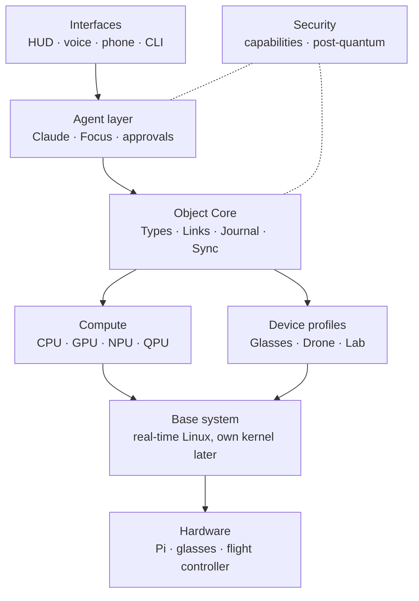
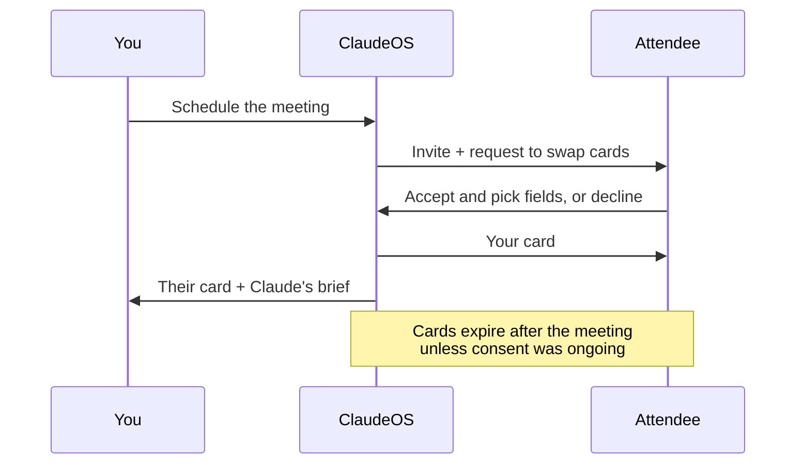
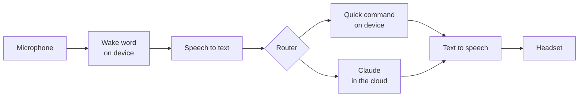
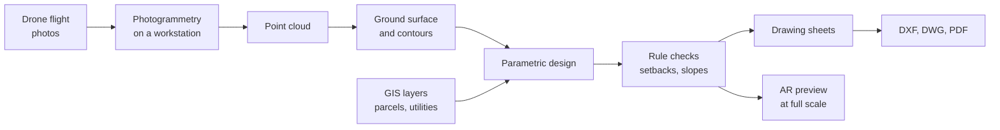

# ClaudeOS Design Spec

Draft v0.1 · September 24, 2026 · Josef Thompson

ClaudeOS is an AI-native operating system for Raspberry Pi–powered AR glasses and drones. It organizes everything by meaning (Objects, Links, Places and Pipelines) instead of folders, treats Claude as a supervised operator, and builds quantum readiness in from day one. This is draft v0.1. The Phase 1 Rust/SQLite Object Core prototype is underway; later roadmap phases remain design-only.

## The organizing idea: beyond folders

Folders answer one question: where is this stored? ClaudeOS answers four instead: **what is it** (Type), **what is it connected to** (Links), **where and when does it belong** (Place and Time), and **what matters right now** (Focus). Types and Links come from Anytype. Place and Time come from glasses and drones working in physical space. Focus comes from how Claude works.

| Windows / Linux | ClaudeOS | What changes |
| --- | --- | --- |
| File | Object | A note, photo, contact, mission, sensor log or device. It has a permanent ID, not a path. |
| File extension | Type | Defines an object's properties, allowed values and actions, plus a plain-language description Claude reads. |
| Metadata | Properties | Each value records who set it (you, Claude or a sensor), when, and how confident. |
| Folder | Collection or Query | A Collection is hand-picked; a Query is a live rule ("open tasks due this week"). An object can sit in any number of both. |
| Shortcut / symlink | Link | Typed and two-way: Flight 12 *flew* Mission 3, and Mission 3 *produced* Flight 12. |
| Folder tree | Graph | You browse by connections, not by nesting. |
| (no equivalent) | Place and Time | Any object can carry a location and a time span, so the glasses can show it where it belongs. |
| Working directory | Focus | The objects relevant to the current task: what you see, and what Claude loads. |
| Search box | Ask | Plain-language questions, answered from the graph. |
| Script / batch file | Pipeline | A visible, re-runnable chain of steps. Claude writes pipelines rather than acting ad hoc. |
| Application | Views and Actions on Types | The Mission type brings a map view, a HUD card and a "plan route" action. Apps attach to Types, not file extensions. |
| Desktop / user profile | Space | A separate world per domain (Personal, Drone Ops, Lab), each with its own members and permissions. |
| Recycle Bin | Journal | Every change, by you or Claude, is recorded and can be undone. |
| OneDrive | ClaudeOS Cloud | Encrypted sync of Spaces across your devices (see below). |

One rule ties it together: **objects are linked, never copied.** A drone photo exists once. It appears in its Flight, its Mission, a Findings query and your AR view as references to the same object.

## Designed around how Claude works

Folders were designed for people with filing cabinets. ClaudeOS is designed for a person and an AI working together. Each rule below answers a real strength or limit of how I work. I can't inspect my own internals, but these patterns hold in practice.

| How Claude works | What ClaudeOS does about it |
| --- | --- |
| I understand meaning, not locations. A path like /home/pi/data/log3.csv tells me little. | Every Type carries a description, and every object has a title and typed properties I can read. |
| I can only hold a limited amount at once (my context window). | Focus assembles the relevant slice from Queries, Links, Place and Time. Nothing else is loaded. |
| I act through tools, and I'm most reliable when each one is clearly described. | Every OS function is a typed action with defined inputs and outputs, exposed through the Model Context Protocol (MCP), the open standard Claude already uses for tools. |
| I don't remember past sessions unless something stores it. | The object graph is the memory. Decisions, preferences and history are objects I can re-read. |
| I can be wrong, sometimes confidently. | My changes are marked as mine, start as suggestions with a confidence score, and can be undone from the Journal. |
| I'm most dependable when I plan before acting. | For multi-step work I write a Pipeline you can review, then the Pipeline runs. |
| I run in Anthropic's cloud, and glasses and drones lose signal. | The OS is local-first. Everything works offline, with a small on-device model for speech and basics. Claude is a powerful optional layer. |

The result is a clear division of labour: **you decide, Claude plans and explains, and the OS executes and enforces the rules.**

## Automatic labeling and search

Every file or folder that enters ClaudeOS is labeled and linked automatically, and anything can be found by asking "Claude AI, find…". This mirrors how I work. I don't have a hidden filing system; I read something, work out what it is and what it relates to, and connect it to what's already known. ClaudeOS saves those judgments as Types, Properties and Links, so they last and can be searched.



| What gets labeled | Example | Done by |
| --- | --- | --- |
| Type | Invoice, Contract, Photo, Flight log, Design | On device, confirmed by Claude |
| Title and summary | "Drone insurance renewal, Acme, 2026" | Claude |
| Dates and places | Photo taken 12 May 2026 at the north field | On device, from file metadata |
| People, organizations and projects | Links to the Person and Project objects that already exist | Claude |
| Amounts and key facts | Premium $1,240, due 30 June | Claude |
| Collections and Queries | Added to "Drone Ops" and "Bills due" | Claude, following your rules |
| Duplicates | The same file or a near-identical photo elsewhere | On device |

### Folders from Windows, Linux or OneDrive

- **Nothing is lost:** each file becomes an Object and each folder becomes a Collection.
- **Origins kept:** the original path is stored as a property, so "where did this come from?" still has an answer. Export puts files back into folders.

### Fully automatic, still under your control

- **Automatic by default:** labels are applied without asking. Low-confidence ones go to a short review list instead of being guessed. Any Space can require review for everything.
- **Learns from corrections:** when you fix a label, ClaudeOS saves a rule ("receipts from Acme go in Drone Ops") that Claude follows next time. It's a stored rule Claude reads, not retraining the model.
- **Undoable:** every label records who set it and can be reversed from the Journal.
- **Private Spaces stay private:** Local-only Spaces are labeled by on-device models only and never sent to Claude.
- **Cost-aware:** new items are labeled right away. Bulk imports use Claude's Message Batches API at half the normal price; most batches finish within an hour ([Anthropic](https://platform.claude.com/docs/en/build-with-claude/batch-processing)).

### Search by voice or text

"Claude AI, find the drone insurance contract from last spring" runs four searches at once. Claude turns your words into them and ranks the results, which appear in the HUD, on your phone or read aloud.

| Search | What it matches | Where it runs |
| --- | --- | --- |
| Structured | Type = Contract, date March–May 2026 | On device |
| Links | Linked to the Drone Ops project and the insurer | On device |
| Keyword | Words inside files, including text read from scans | On device |
| Meaning | "Insurance" also finds "coverage" and "policy" | On device, with a small embedding model |

Anthropic doesn't make embedding models and recommends Voyage AI ([Anthropic](https://platform.claude.com/docs/en/build-with-claude/embeddings)). An open-weight model such as voyage-4-nano, or another small model, will be tested on the Pi so meaning search works offline. Offline, all four searches still run; Claude interprets tricky wording when you're online.

## Lessons from ArcGIS Pro and FME Workbench

Both tools already organize large amounts of connected, located data without relying on folders. ArcGIS Pro contributes how data is described and shown. FME contributes how data is moved and transformed.

| Borrowed idea | From | Becomes in ClaudeOS |
| --- | --- | --- |
| A project holds maps, layouts and connections to data, not the data itself ([Esri](https://doc.esri.com/en/arcgis-pro/latest/help/projects/what-is-a-project.html)) | ArcGIS Pro project | A **Space** holds Views, Pipelines and references to Objects. The same object can appear in many Spaces. |
| A layer is a styled, filtered reference to a dataset (a definition query) | ArcGIS Pro layers | A **View** is a Query plus a style. The glasses stack Views as layers over the real world: terrain, geofence, waypoints, findings. |
| Maps (2D) and scenes (3D) | ArcGIS Pro | **Map** for planning; **Scene** for the AR glasses, anchored to real positions. |
| Schemas with fields, domains (allowed values) and subtypes | ArcGIS geodatabase | **Types** whose Properties have allowed values and units, so Claude can't write "high-ish" into a numeric field. |
| Relationship classes | ArcGIS geodatabase | **Typed Links** with rules on which types and how many (a Flight links to exactly one Drone). |
| Attribute rules that calculate, constrain and validate on insert, update or delete ([Esri](https://pro.arcgis.com/en/pro-app/3.5/help/data/geodatabases/overview/attribute-rules-and-relationship-classes.htm)) | ArcGIS geodatabase | **Rules on Types**: aborting a Mission cancels its scheduled Flights, and a Mission can't be approved without a geofence. |
| One coordinate system per feature dataset | ArcGIS geodatabase | Every Space declares one spatial reference, so drone GPS, map data and AR anchors line up. |
| Workspace: readers, then transformers, then writers, on a canvas | FME Workbench | **Pipeline**: Adapters in, Steps, Adapters out, drawn as a graph you can inspect. |
| Hundreds of format readers and writers | FME | **Adapters** that turn outside files (CSV, KML, GeoTIFF, photos, USB drives, OneDrive) into Objects and back. This is how ClaudeOS talks to Windows and Linux. |
| Custom transformers: a group of steps saved as one reusable block ([Safe Software](https://docs.safe.com/fme/html/FME-Form-Documentation/FME-Form/Workbench/custom_transformer_creating.htm)) | FME Workbench | **Skills**: a Pipeline written once by you or Claude, saved and reused ("detect roof damage"). |
| Inspecting data between steps (feature caching) | FME Workbench | **Dry run**: every Pipeline can show its output at each step before it changes anything. |
| Event-driven automations | FME Flow | **Automations**: when a Flight finishes, run "detect damage", then post findings to the glasses. |
| Geoprocessing history | ArcGIS Pro | The **Journal** records every Pipeline run with its inputs, so any result can be traced and re-run. |

The key lesson from FME: **Claude writes pipelines instead of taking one-off actions.** A pipeline can be reviewed before it runs, tested with a dry run, re-run later and saved as a Skill. The same graph editor can hold quantum circuits, since a circuit is also a chain of operations (see Quantum readiness in practice).

## ClaudeOS Cloud

ClaudeOS Cloud keeps your Spaces in sync across glasses, drone, base station and phone, the way OneDrive does for files. Anthropic doesn't offer a consumer sync drive, so ClaudeOS Cloud combines a sync layer you control with Claude's API for the intelligence.

| Part | What it does | Built on |
| --- | --- | --- |
| Sync | Keeps Objects identical across devices; works offline and merges changes when back online. End-to-end encrypted, so the server can't read your data. | A self-hosted sync server (home server or cloud VM). Anytype's sync stack is a candidate, but its core library uses the [Any Source Available License 1.0](https://github.com/anyproto/anytype-heart), so check the terms before reusing it. |
| Claude access | Sends Claude only the Focus a task needs, never whole Spaces. | Claude Messages API |
| Large files | Uploads a big file once (a flight video, a PDF manual) and refers to it by ID in later requests. | Claude [Files API](https://platform.claude.com/docs/en/build-with-claude/files): generally available, up to 500 MB per file and 1 TB per organization. Files stay until deleted or until an optional 1-hour to 90-day expiry. |
| Bridges | Pulls from and pushes to OneDrive, Google Drive or Dropbox, so nothing is locked in. | Adapters (see FME lessons), using MCP connectors or each service's API |

Each Space has a privacy level you choose:

- **Local only**: never leaves the device.
- **Synced**: shared between your devices, encrypted end to end.
- **Claude-visible**: its Focus may be sent to Claude when you ask for help.

One caution from the Files API docs: uploaded files are visible to every API key in the same workspace. Each ClaudeOS owner should get their own API workspace.

## Quantum principles as design rules

These are analogies, not quantum physics. ClaudeOS runs on ordinary chips, and each rule stays only because it solves a real problem today. Working this way builds the habits quantum programming needs: thinking in probabilities, reversible steps and correlated state.

| Quantum principle | In physics | ClaudeOS rule | Problem it solves today |
| --- | --- | --- | --- |
| Superposition | A qubit holds a blend of 0 and 1 until measured. | An object sits in many Collections, Queries and Spaces at once, not in one folder. | No duplicates, and no "which folder did I put it in?" |
| Measurement | Measuring forces one definite outcome. | Claude's suggestions (tags, links, summaries) stay "suggested", with a confidence score, until you accept or reject them. Accepting makes them fact. | The AI never silently rewrites your data. |
| Probability | Outcomes come with probabilities. | "Uncertain value" is a built-in property type: a value plus a confidence or a range. | One type serves AI guesses (80% sure it's a crack), sensors (GPS ±3 m) and later quantum results (a histogram). |
| Entanglement | Two qubits' measurement results stay correlated, however far apart. | Linked objects can carry rules that keep them consistent. | Aborting a Mission cancels its Flights automatically. |
| Reversibility | Every quantum gate has an inverse. | Every operation records its inverse in the Journal. | Any change, even a whole Claude task, can be rolled back. |
| No-cloning | An unknown quantum state can't be copied. | Objects are referenced, never duplicated. There is one source of truth. | No conflicting copies across devices. |
| Decoherence | Quantum states fade through contact with their surroundings. | Suggestions and Focus expire unless confirmed or refreshed. | Stale AI guesses don't pile up. |

## Quantum readiness in practice

Quantum computers won't replace the Pi's processor or fit inside glasses and drones. Most current machines need lab conditions such as cryogenic cooling. They will arrive as remote accelerators, reached over the network like a cloud GPU. They're expected to help with specific problems: simulating molecules and materials, some optimization and sampling tasks, and breaking today's public-key encryption. ClaudeOS prepares in four concrete ways.

### 1. Post-quantum security from day one

This is the most urgent step. Data recorded today could be decrypted once large quantum computers exist ("harvest now, decrypt later"). NIST finalized its first post-quantum standards on 13 August 2024 ([NIST](https://www.nist.gov/news-events/news/2024/08/nist-releases-first-3-finalized-post-quantum-encryption-standards)).

| Standard | Algorithm | ClaudeOS use |
| --- | --- | --- |
| FIPS 203 | ML-KEM (key exchange) | Sync, the Claude connection and device pairing, as hybrid X25519 + ML-KEM |
| FIPS 204 | ML-DSA (signatures) | Signing OS updates, Skills and drone mission files |
| FIPS 205 | SLH-DSA (hash-based signatures) | Backup scheme for firmware and long-lived records |

OpenSSL 3.5 supports all three and offers hybrid X25519MLKEM768 as a default TLS key share ([OpenSSL](https://openssl-library.org/post/2025-03-11-openssl-3.5-alpha/index.html)), so no custom cryptography is needed. Algorithm names live in configuration, so they can be swapped as standards change. For drone radio links, 256-bit symmetric keys hold up against known quantum attacks. The weak points are how keys are exchanged and how firmware is signed.

### 2. A compute layer with a QPU slot

ClaudeOS treats compute as pluggable backends: CPU, GPU, NPU (an AI accelerator board) and QPU. A quantum job is an Object of Type Quantum Job, with properties for the circuit, backend, shots, status and result. Circuits are stored in OpenQASM 3, a widely used circuit format that Qiskit (IBM) and Amazon Braket can read. The backend starts as a local simulator and later routes to cloud QPUs, with nothing above it changing.

### 3. Problems written in quantum-ready form

Some drone problems can be written as a QUBO (quadratic unconstrained binary optimization), the input form for quantum annealers and the QAOA algorithm. Examples: ordering 40 inspection points, assigning drones to zones, scheduling battery swaps. ClaudeOS writes them that way now and solves them classically on the Pi, for example with simulated annealing. Later the same problem object can go to a QPU. Whether quantum beats classical on these problems is unproven, so the OS runs both and logs which did better.

### 4. Quantum Lab: practice inside the OS

A built-in simulator makes learning part of daily use. Circuits are Objects, gates are steps in the Pipeline editor, and results are histograms stored as Uncertain values. Claude explains each step in plain language, including on the glasses. A state-vector simulator needs this much memory for n qubits:

```math
\text{memory} = 16 \text{ bytes} \times 2^{n}
```

| Qubits | Memory | On a Raspberry Pi |
| --- | --- | --- |
| 20 | 16 MB | Fast on any model |
| 25 | 512 MB | Comfortable on a Pi 4 or 5 with 2 GB or more |
| 28 | 4 GB | Pi 5 with 8 GB, slow |

Starter lessons:

1. One qubit and superposition (the Hadamard gate)
2. Measurement: run 1,000 shots and watch the 50/50 split
3. Entanglement: a two-qubit Bell state
4. Interference: H, Z, H gives a definite answer
5. Grover's search on 2–3 qubits
6. Quantum teleportation
7. QAOA on a 4-waypoint drone route, linking back to part 3

## Architecture

ClaudeOS is seven layers. Everything above the base system talks to it only through defined interfaces, so a custom kernel can replace Linux later without rewriting ClaudeOS.



Requests flow down: you ask, Claude plans, the Object Core records, and devices act. Security wraps the agent and the data.

| Layer | Responsibility | Starting technology |
| --- | --- | --- |
| Interfaces | AR scenes, voice, a phone or web companion view, a command line | GPU UI toolkit to decide |
| Agent layer | Builds Focus, plans Pipelines, registers tools, asks for approvals; on-device speech for offline use | Claude API, MCP, an on-device speech-to-text model |
| Object Core | Objects, Types, Properties with provenance, Links, Queries, Rules, Pipelines, Journal, Sync | Rust service on SQLite, with a CRDT library (such as Automerge) for conflict-free sync |
| Security | Scoped permissions per app and per agent; post-quantum encryption and signing | OpenSSL 3.5 or later |
| Compute | Schedules work on the right backend | Pi CPU and GPU, an NPU board, a quantum simulator, cloud QPUs later |
| Device profiles | Glasses: HUD, head tracking, voice. Drone: MAVLink bridge, telemetry into Objects, mission compiler, geofence checks. Lab: quantum simulator. | MAVLink, PX4 or ArduPilot on the flight controller |
| Base system | Boot, drivers, networking, real-time scheduling | Minimal Linux built with Buildroot, with real-time (PREEMPT\_RT) support; a Rust microkernel as a long-term track |

## Diagnostics and bug reports

ClaudeOS watches its own health, lets Claude AI explain what went wrong, and turns problems into bug reports you can email and edit anywhere. Nothing is sent without your OK.

### Catching problems

| What's watched | How |
| --- | --- |
| Crashes and freezes | Every service is supervised and restarted. A hardware watchdog reboots a frozen Pi, and logs survive the restart. |
| Overheating and low power | The Pi's temperature and power-throttling readings |
| Failed Pipelines and Claude requests | Errors recorded in the Journal with their inputs |
| Drone issues | Flight controller logs (PX4 ULog or ArduPilot dataflash) linked to the Flight |
| Glasses and headsets | Disconnects, dropped audio and display errors |

### Debugging with Claude AI

- **Ask:** "Claude AI, what went wrong?" Claude reads the recent Journal and logs, then explains in plain language.
- **Fix, with approval:** Claude can propose a fix as a reversible Pipeline. You approve it, and it can be undone. Safety settings, such as drone limits, can only be changed by you.
- **Developer mode:** a PIN unlocks a log viewer and remote access from a computer on the same network. It's off by default.

### The bug report

A Bug Report is an Object, linked to the Journal entries and objects involved.

| Part | What it holds |
| --- | --- |
| Title and summary | Written by Claude in plain language |
| Steps to reproduce | Rebuilt from the Journal |
| Expected vs. actual | What should have happened, and what did |
| Device details | Pi model, glasses, OS version and connected devices |
| Attachments | Trimmed logs, a HUD screenshot, and the flight log if relevant |
| Severity and status | Set by you; status updates as it's fixed |

### Emailing it for editing elsewhere

- **Editable files:** the report is attached as Markdown, which opens in any text editor, with logs in a .zip. Word or PDF copies are optional.
- **Sending:** through your own email account after a one-time sign-in, or through your phone's email app. Send it to yourself, a developer address, or both.
- **Report ID in the subject:** for example "\[ClaudeOS BUG-0042\]", so revisions and replies stay grouped.
- **Private by design:** before sending, ClaudeOS removes personal data such as names, locations, contact cards, face data and keys, then shows you exactly what will be sent. Other people's data from introductions or calls is always removed.
- **Encryption option:** email isn't end-to-end encrypted by default, so logs can go as an encrypted archive with the password shared separately.
- **Large logs:** Gmail caps personal attachments at 25 MB and turns bigger ones into Drive links ([Google](https://support.google.com/mail/answer/6584?hl=en)). ClaudeOS sends large logs as a ClaudeOS Cloud link instead.
- **Offline:** reports wait in an outbox and send when you're back online.
- **Beta testers:** can choose to send crash reports automatically, still redacted.

## Privacy and people

ClaudeOS never identifies strangers or rates how dangerous they are. It recognizes a person only with their agreement and protects bystanders by default.

1. **No face search of strangers.** The OS has no feature for matching faces against social media or other public databases, and no Skill can add one.
2. **Mutual introductions.** When two ClaudeOS users both agree, their devices swap a profile card over Bluetooth or a QR code. Each person chooses what their card shares.
3. **A memory aid for people you know.** After meeting someone, you can create a Person object with your own notes. Face recognition for that person stays off unless they agree, and withdrawing consent deletes their face data from your device.
4. **Bystander protection in drone footage.** Faces and license plates of people outside the Mission are blurred automatically before footage is stored or synced.
5. **Face data stays local.** Face data from people who agreed is encrypted on your device only. It is never sent to Claude or synced.
6. **Recording is visible.** If the glasses have a recording light, ClaudeOS keeps it on whenever the camera records and never switches it off.

### Meeting briefs, by mutual agreement

ClaudeOS prepares a brief on a meeting attendee only after both sides agree to swap **meeting cards**. Without that agreement, you see only what the invite already says. The same rules apply to Teams, Zoom and in-person meetings.



The request travels as a link in the invite or a prompt in a ClaudeOS app for Teams or Zoom, so attendees don't need ClaudeOS to answer it.

| Attendee's choice | What your brief shows |
| --- | --- |
| No answer, or declined | Name and email from the invite, news about their company, and your own notes from past meetings |
| Accepted: card only | The above, plus the fields they chose to share (role, bio, topics, links) |
| Accepted: card and recognition | The above, plus name labels over their face in the room, for that meeting only |

The rules that make it mutual:

- **Two-way:** you receive their card only if they receive yours. Each person picks what their own card shares.
- **No surprises:** before accepting, each side sees a preview of exactly what the other will see about them.
- **Person-level research needs consent:** Claude looks up an attendee's public professional background only if their card allows it. Company news needs no consent.
- **Revocable:** either side can withdraw at any time. ClaudeOS devices then delete the card and any face data. A copy someone saved outside ClaudeOS can't be recalled, and the consent screen says so.
- **Recorded:** every agreement is a signed Consent object in the Journal.

```yaml
type: Consent
description: One person's agreement to share a meeting card with another.
properties:
  from:         Person
  to:           Person
  scope:        select [this meeting, ongoing]
  fields:       list<select [role, company, bio, topics, links, public background]>
  recognition:  checkbox       # name labels over their face, this meeting only
  granted_at:   date
  expires_at:   date
  revoked_at:   date
  signature:    ML-DSA
rules:
  - a card is visible only while a matching Consent exists in both directions
  - on expiry or revocation, delete the card and face data on every ClaudeOS device
```

### Beta test: signed introductions

The beta tests sharing between two or more people who all wear ClaudeOS glasses. Nothing, including social media accounts, appears in anyone's view until every person in the group has signed. It runs after Phase 4 (glasses profile).

#### What we took from the 2024 glasses demo, and what we reversed

In October 2024, Harvard students AnhPhu Nguyen and Caine Ardayfio showed that modified Meta Ray-Ban glasses could go from a stranger's face to their name, phone number and home address ([404 Media](https://www.404media.co/someone-put-facial-recognition-tech-onto-metas-smart-glasses-to-instantly-dox-strangers/)). They built it to raise awareness and did not release the code. ClaudeOS keeps the goal of knowing who you're talking to but reverses the flow: people push their own card, instead of the glasses pulling data about them.

|  | 2024 demo | ClaudeOS |
| --- | --- | --- |
| Who starts it | The wearer, without the other person knowing | Everyone in the group, knowingly |
| How identity is found | Face matched against face-search engines and public records | Each person shares their own card after signing |
| What's shown | Whatever could be found, including home addresses and family members | Only the fields each person picked |
| Accuracy | Face matches can be wrong | Social accounts verified by signing in, or labeled "self-reported" |
| Undo | None | Revocable at any time, and expires by default |

#### How it works

1. **Open to introductions.** Each wearer switches this on. Their glasses broadcast an anonymous Bluetooth ID that changes every 15 minutes.
2. **Form the group.** One person starts "Introduce" and nearby people who are open can join. Everyone's glasses show the same two words, which the group says aloud to confirm.
3. **Preview.** Each person picks their card's fields, including which social accounts (Instagram, Facebook, LinkedIn) to share. They see exactly what every other member will receive.
4. **Sign.** Each person signs with one of the methods below. The person who starts the group can require a minimum method, such as email confirmation for a business meeting.
5. **All or nothing.** Cards swap only when every member has signed within 2 minutes. If anyone declines or runs out of time, nothing is shared with anyone.
6. **Read.** Each card appears in the HUD. Social profiles open in that platform's own app; ClaudeOS never scrapes them.
7. **Expire or revoke.** Cards expire after 24 hours unless everyone chooses "ongoing". Revoking removes your card from every member's glasses.

When someone adds a social account to their card, ClaudeOS asks them to sign in to that platform to prove they own it. Not every platform offers this for personal accounts, so unverified handles are labeled "self-reported".

#### Signature methods

Every method unlocks the same thing: a cryptographic signature (ML-DSA) from a key stored on the person's own glasses. The signed Consent records who agreed, to what, when, and which method they used.

| Method | Best for | What it proves | Limits |
| --- | --- | --- | --- |
| Personal PIN | In person; fastest | The owner of these glasses agreed | Entered on the paired phone or the glasses' touchpad, never spoken aloud. Checked on the device and never sent. |
| Email confirmation | Remote meetings and first-time card setup | The person controls that email address | Needs a connection and access to their inbox, so it's slower |
| Drawn signature | A deliberate, visible "I agree" moment | A record of intent, as in e-signing tools | Easy to imitate, so it always rides on the device key. Drawn on the paired phone, since glasses have no screen to draw on. |

```yaml
type: Introduction
description: A group of two or more people agreeing to swap cards.
properties:
  parties:      list<Person>     # two or more
  words:        text             # the shared confirmation words
  min_method:   select [PIN, email confirmation, drawn signature]
  signatures:   list<Consent>    # one per party, each recording its method
  status:       select [forming, signing, shared, cancelled, expired]
  expires_at:   date
rules:
  - status becomes shared only when every party has a valid signature
  - any decline, or a 2-minute timeout, cancels it for everyone
  - a revoked signature removes that person's card from every party
```

| Beta test | Passes when |
| --- | --- |
| Read before consent | No card data reaches any device before every member signs. |
| One person declines | Nothing is shared with anyone, and the others see "not now". |
| Timeout | If anyone hasn't signed within 2 minutes, the exchange cancels for all. |
| Wrong person | Mismatched words stop the exchange. |
| Bad signature | A card with a missing or invalid signature is rejected. |
| Unverified account | Handles not verified by sign-in show "self-reported". |
| Revocation | The card disappears from every member's glasses within 5 seconds if in range, or at their next connection. |
| Out of range mid-exchange | The exchange cancels cleanly, with nothing half-shared. |
| Tracking | A logged Bluetooth ID can't be linked to the same wearer after it rotates. |
| Speed | Cards appear within 5 seconds of the last signature, for groups of up to 6. |

## Voice, headsets and phones

Any standard headset or phone works with ClaudeOS glasses. The same headset carries calls, meeting audio and voice commands to drones. This adds one Audio service to the Device profiles layer.

### Universal connections

The glasses' Pi pack supports the standards nearly every headset and phone already uses, so no special hardware is needed.

| Device | Connection | Standard | Notes |
| --- | --- | --- | --- |
| Any Bluetooth headset or earbuds | Bluetooth Classic | HFP for calls and microphone; A2DP for high-quality listening | Works on the Pi's built-in Bluetooth 5.0 radio ([Raspberry Pi](https://www.raspberrypi.com/products/raspberry-pi-5/)) |
| Newer earbuds and hearing aids | Bluetooth LE Audio | LC3 codec; Auracast for broadcast ([Bluetooth SIG](https://www.bluetooth.com/learn-about-bluetooth/recent-enhancements/le-audio/)) | Better sound at lower power. Needs a Bluetooth 5.2 or later USB adapter, and Linux support is still maturing. |
| USB-C headsets | USB-C cable | USB Audio Class | Lowest delay and no pairing; no drivers needed |
| 3.5 mm headsets | USB-C adapter | USB Audio Class | Any wired headset, through a standard adapter |
| iPhone or Android phone | Bluetooth LE, Wi-Fi or USB-C | ClaudeOS companion app | Setup, internet via hotspot, typing PINs, drawing signatures, joining Teams or Zoom |

ClaudeOS picks the best route automatically and falls back if one fails: wired first, then LE Audio, then Classic Bluetooth.

### Voice assistant: just say "Claude AI"

Claude can be voice-activated like Siri or Alexa. Say "Claude AI", ask anything, and hear the answer in your headset or the glasses' speakers. You can switch it on or off at any time.

The wake word is "Claude AI". Longer wake words are harder to set off by accident, the same reason some iPhone users keep "Hey Siri" rather than just "Siri" ([TechHive](https://www.techhive.com/article/1945963/hey-siri-trigger-phrase-ios17.html)). It also won't respond to anyone else named Claude. Safeguards still apply:

- **Trained against sound-alikes:** phrases like "cloud AI", a common tech phrase, and "clawed" are negative examples when the wake-word model is trained.
- **Only at the start:** it responds when "Claude AI" follows a short pause and a request follows, not when the name comes up mid-sentence.
- **Your voice only, if you want:** owner-only voice enrollment stops other people from waking it.
- **Other options in settings:** "Claude" alone, "Hey Claude", or a name you choose.



Claude's API accepts text and images but not audio ([Claude API](https://platform.claude.com/docs/en/api/messages)), so ClaudeOS turns speech into text before Claude and back into speech after.

| Stage | Runs where | Tool | Notes |
| --- | --- | --- | --- |
| Wake word | On device, while switched on | [openWakeWord](https://github.com/dscripka/openWakeWord) | We train our own "Claude AI" model, since the project's pre-trained models are licensed for non-commercial use only. One Pi 3 core runs 15–20 wake-word models in real time. |
| Quick commands | On device | Fixed-phrase recognition, like Home Assistant's Speech-to-Phrase | Under a second on a Pi 4 ([Home Assistant](https://www.home-assistant.io/voice_control/voice_remote_local_assistant/)). Covers volume, time, "stop listening" and drone emergency words. |
| Open questions | Paired phone or a cloud speech service when allowed; the Pi as offline fallback | Whisper | Whisper takes around 8 seconds per command on a Pi 4, so the fast path runs elsewhere. |
| Thinking | Cloud | Claude API | Streams its reply, so speech starts before the whole answer is written |
| Speaking | On device | [Piper](https://github.com/OHF-Voice/piper1-gpl) (GPL-3.0, run as a separate service) | Produces about 1.6 seconds of speech per second on a Pi |

Target: the first spoken words within 2 seconds of finishing a question, when online.

#### Switching it on and off

- **Any time, several ways:** say "Claude AI, stop listening", tap the glasses' button, use the phone app, or change it in settings.
- **Off means off:** the wake-word listener stops and the microphone is released. Nothing is heard, processed or stored.
- **Back on by touch:** since nothing listens while it's off, switching back on takes a button, tap or the phone app, never your voice.
- **Push-to-talk instead:** with the wake word off, you can still ask Claude by holding a button.
- **Automatic rules:** switch it off during meetings, at set hours, or in chosen Places.
- **Always visible:** a HUD icon, and a light if the glasses have one, shows whether Claude is off, waiting for the wake word, or listening to you.

#### How it behaves

- **Nothing leaves before the wake word:** audio is checked on the device and discarded unless it hears "Claude AI".
- **Natural follow-ups:** after answering, Claude listens for 5 seconds for a follow-up without the wake word.
- **Interrupt anytime:** start speaking and Claude stops talking.
- **Your voice only, if you want:** enroll your voice so Claude answers only you. The voice data stays on the device. Voices can be imitated, so sensitive actions still need your PIN or confirmation.
- **Calls and flights:** "Claude AI" arriving through call audio is ignored. During flights the assistant can't fly the drone; commands still need the command button.
- **Same rules as typing:** voice requests use the same approvals, Journal and privacy settings as everything else.
- **Rename it:** you can choose a different wake word.

#### Custom voices

Claude can speak in any voice you add, and you can switch voices at any time.

| Source | How you add it | Consent needed |
| --- | --- | --- |
| Voice library | Pick from built-in voices in many languages and accents | None |
| Any compatible voice file | Import a Piper-compatible voice model, or add another speech engine as a plug-in | Check the voice's license |
| Your own voice | Record a set of sentences. Training runs on a workstation or cloud GPU; the finished voice runs on the Pi. | Each recording session starts with a spoken consent phrase, which shows the recordings are yours |
| Someone else's voice | They record the sentences themselves | Their signed consent (PIN, email or drawn signature), revocable at any time |

- **No voices without agreement:** ClaudeOS won't build a voice from recordings of anyone who hasn't signed, including public figures. Using someone's voice without permission is also illegal in some places.
- **Custom voices speak only to you:** they're never used on calls or sent to other people, so nobody can be impersonated.
- **Revoking deletes:** if someone withdraws consent, their voice model is deleted from every ClaudeOS device.
- **Different voices for different jobs:** for example, one voice for Claude's answers and another for drone alerts, so alerts stand out.

### Talk: calls from a distance

Talk lets ClaudeOS users speak to each other through their headsets.

| Mode | Range | How it travels |
| --- | --- | --- |
| Calls and group calls | Anywhere with internet | End-to-end encrypted voice (WebRTC with the Opus codec). Post-quantum key exchange where the protocol allows, to research in Phase 2. |
| Push-to-talk channels | Anywhere with internet, or across a site without it | A walkie-talkie for a team. Works over a local Wi-Fi network when there's no internet. |
| Teams and Zoom meetings | Anywhere with internet | Joined through Microsoft's and Zoom's official SDKs where available. Otherwise the phone joins and the glasses act as its headset. |

Rules that match the rest of ClaudeOS:

- **No unsolicited calls:** you can call someone only after you've swapped cards, or when they invited you.
- **Recording needs everyone's OK:** captions, transcripts and recordings are announced on the call and start only when all agree. Some places, including California, require this by law.
- **Captions in the HUD:** live captions come from on-device speech recognition. Claude translates or summarizes only if everyone agreed to transcription.

### Talking to drones

Your headset becomes the drone's voice channel: you speak commands and hear status back. Your voice never goes to the drone. The glasses turn speech into a small set of safe mission commands and send them over MAVLink.

| You say | What happens | Confirmation |
| --- | --- | --- |
| "Status" | Battery, altitude, distance and mission progress, read into your ear | None |
| "Take a photo" or "Start recording" | Camera action | None |
| "Pause" or "Hold position" | The drone hovers in place | None; works instantly |
| "Return home" or "Land now" | Failsafe action | None; works instantly, even offline |
| "Resume mission" | Continues the approved Mission | Spoken readback |
| "Take off" | Starts an approved Mission | Readback plus "confirm", and a PIN if set |
| "What do you see?" | Claude describes the camera view | None |

Drone status can also be shared on a team push-to-talk channel, so everyone on site hears it.

Voice safety rules:

1. **Push-to-talk for commands.** Commands count only while you hold the headset or glasses button, so nearby conversation can't steer the drone.
2. **Emergency words work offline.** "Pause", "return home" and "land now" are recognized on the device in a fraction of a second, without Claude or the internet.
3. **The hand controller always wins.** Voice never overrides the pilot's controller and can't change the geofence or limits.
4. **Only the paired pilot.** Commands are accepted only from the headset paired to the pilot's glasses for that Mission.
5. **Everything is logged.** Each voice command and its result is stored in the Flight's Journal.

### Operator-to-operator calls in flight

Operators can talk to each other mid-flight as easily as a phone call, hands-free, through the same headset. This also covers the FAA rule that the remote pilot, the person on the controls and any visual observer "maintain effective communication with each other at all times" ([14 CFR 107.33](https://www.ecfr.gov/current/title-14/chapter-I/subchapter-F/part-107/subpart-B/section-107.33)).

| Channel | Who's on it | How you join |
| --- | --- | --- |
| Direct call | You and one other operator | Like a phone call, with people you've swapped cards with or who invited you |
| Crew channel | Everyone on the same Operation: pilots, visual observers, ground crew | Invited by whoever created the Operation |
| Nearby airspace channel | ClaudeOS operators within 2 km who opted in | Opt in per flight. You appear by call sign and drone position, not by name, unless you swap cards. |

The nearby channel borrows from manned aviation, where pilots near an airport without a control tower announce their position on a shared frequency.

#### Keeping calls and commands apart

One headset carries four kinds of sound, so ClaudeOS sets clear priorities.

| Sound | Priority | Behavior |
| --- | --- | --- |
| Safety alerts (low battery, geofence, nearby aircraft, lost link) | 1 | Interrupt everything; call audio is lowered |
| Your drone commands, while you hold the command button | 2 | Go only to your drone. Your mic is muted on the call, then the crew hears a short announcement ("Drone 2 returning home"). |
| Calls with other operators | 3 | Normal conversation |
| Drone status readouts | 4 | Spoken between sentences, never over someone talking |

- **Two buttons:** one talks to people, the other commands the drone. Nothing said on a call can control a drone.
- **Other voices can't command your drone:** commands come only from your own microphone while you hold the command button. Voices arriving through the call are filtered out of command recognition.
- **Quiet during takeoff and landing:** calls are held to urgent traffic only, like aviation's "sterile cockpit" rule. An operator can mark a call "urgent" to break through.
- **See who's talking:** each operator on a channel appears in the HUD as a label on their drone's position.
- **Nearby drones:** the glasses also read Remote ID broadcasts from nearby drones ([FAA](https://www.faa.gov/uas/getting_started/remote_id)) and show them on the map, so operators can warn each other. ClaudeOS shows the aircraft only, never a stranger's control station location.

#### Staying connected in the field

| Situation | Route |
| --- | --- |
| Mobile coverage | Encrypted internet call |
| No coverage, same site | Local Wi-Fi between glasses, extended with a portable router or mesh |
| No coverage, spread out | A handheld two-way radio plugged in like a headset. In the US, FRS radios need no license and GMRS needs an FCC license. These channels are public and unencrypted, so avoid sensitive details. |
| Remote sites | Satellite internet, where available |

The drone's control and telemetry radio is never used for voice, so calls can't crowd out the control link.

## Safety rules

These rules are built into the OS. No prompt, Skill or setting can switch them off.

1. **Claude never flies the drone.** Stabilization and motor control stay on the flight controller. Claude writes Missions; the flight controller runs them and enforces the geofence and failsafes, such as return-to-home on signal loss, on its own.
2. **Physical and irreversible actions need a person.** Arming, takeoff, entering new airspace, deleting data and sending anything outside ClaudeOS require your confirmation by voice or tap.
3. **Claude gets scoped permissions.** Each Space grants the agent specific actions (for example, read and draft Missions) and nothing more.
4. **What Claude reads can't give it orders.** Text from documents, web pages and messages is treated as data. It can never grant new permissions.
5. **Everything is journaled.** Every Claude action records what it did, why, and how to undo it.
6. **Simulation before hardware.** Every drone behavior runs first in a simulator (PX4 or ArduPilot software-in-the-loop with Gazebo).
7. **The glasses never block your view.** Alerts stay at the edges while you're moving, and one command clears the display.
8. **Follow the law.** In the US, flights follow FAA rules: a Part 107 certificate for commercial work and Remote ID for most drones. Check the current rules before testing.

## Blueprint: the built-in design app

Blueprint is ClaudeOS's answer to Microsoft Paint: a design app that ships with the OS. Instead of pixels, it draws engineering geometry. It turns requirements, GIS layers and drone surveys into parametric 3D models and AutoCAD-compatible drawings, all placed in real-world coordinates.

One idea makes it fit the rest of ClaudeOS: **a CAD feature tree is a Pipeline.** Sketch, extrude, cut and fillet are steps in a chain, just like FME transformers. The same engine runs data flows, designs and quantum circuits.

### The 3D design space

Every design sits in its Space's coordinate system, so a building pad, a utility line and a drone flight path line up exactly. Each Design has a local origin tied to real-world coordinates, which keeps numbers small and precise. Every part is placed with a transformation matrix:

```math
p_{\text{world}} = M \, p_{\text{local}}, \qquad M = \begin{bmatrix} R & t \\ 0 & 1 \end{bmatrix}
```

R holds rotation and scale; t holds position. Survey-grade projects also store the grid-to-ground scale factor, so distances measured on site match the drawing.

### Designs as Objects

| Type | What it is | Linked to |
| --- | --- | --- |
| Design | A project: a site plan, part or structure | Its Space, Requirements and Drawings |
| Sketch | A 2D profile with dimensions and constraints | The Feature that uses it |
| Feature | One modeling step: extrude, revolve, cut, fillet | The previous Feature, forming the Pipeline |
| Parameter | A named value, such as pad width = 6 m | The Requirements it affects |
| Requirement | What the design must do ("drains to the street") | The Parameters that satisfy it |
| Part and Assembly | Solid bodies and how they fit together | Materials, suppliers and Drawings |
| Drawing | A 2D sheet: plan, elevation, section, dimensions | The Design it documents |
| Reality capture | A point cloud or mesh from a drone survey | The Flight that produced it |

### The design matrix

Blueprint keeps a live matrix of Requirements against Parameters, the idea behind axiomatic design. Each X marks a parameter that affects a requirement.

| Requirement | Pad width | Pad slope | Wall height |
| --- | --- | --- | --- |
| Fits two vehicles | X |  |  |
| Drains to the street |  | X |  |
| Stays within the setback | X |  | X |

When a change touches more than one requirement, Claude flags it before you accept. Here, widening the pad affects both parking and the setback.

### From drone survey to blueprint



Each box is a Pipeline step you can inspect, dry-run, and re-run when the survey or requirements change.

### Formats and tools

| Format | Used for | Tool |
| --- | --- | --- |
| DXF | AutoCAD exchange | [ezdxf](https://ezdxf.readthedocs.io/en/stable/) (MIT license); reads and writes DXF R12 to R2018 |
| DWG | AutoCAD's native format | [ODA File Converter](https://www.opendesign.com/guestfiles/oda_file_converter) (free; Windows, macOS and Linux x64, not the Pi), or FME with your license |
| STEP, IGES | Mechanical parts | Open CASCADE, the geometry kernel |
| IFC | Buildings (BIM) | IfcOpenShell |
| LAS, LAZ | Point clouds | PDAL |
| GeoPackage, Shapefile, GeoJSON, KML | GIS layers | GDAL |
| glTF | 3D models in the glasses | Built in |
| PDF | Printed sheets | Built in |

Parametric scripting uses CadQuery, built on Open CASCADE. Photogrammetry uses OpenDroneMap. FreeCAD can open the same files on a desktop. All of these are open source.

### Claude's role, and the limits

- **Plain language to geometry:** you say "a 6 by 12 m concrete pad, 150 mm thick, sloping 2% to the street". Claude writes the parametric steps as a reviewable Pipeline. You preview it in 3D, or at full scale on site, before accepting.
- **Rule checks:** Claude checks the design against GIS layers and your rules: setbacks, clearances, slopes, buried utilities.
- **Drafts, not stamped drawings:** Claude's geometry must be checked by a qualified engineer. Drawings that require a professional stamp need a licensed professional.
- **What the Pi can do:** view models, edit small parts and export DXF. Photogrammetry, DWG conversion and large assemblies go to a workstation or cloud backend.
- **AR accuracy:** overlaying a design on the real site needs glasses with full 6DoF tracking and centimeter-level positioning (RTK GNSS or surveyed markers). Phone-grade GPS can be off by several meters.

## Street Safety: area risk and personal safety

Street Safety helps you judge how risky an area is and get help fast, without judging the people around you. It works on request, from official crime data, map information and your own situation.

### Area risk, when you ask

Say "Claude AI, how safe is this area?" or check a route before you go. Street Safety combines:

| Source | What it adds | Limits |
| --- | --- | --- |
| City open-data crime reports | Recent incidents by type, time of day and block | Published with a delay, usually generalized to the block, and only covers reported crimes |
| FBI Crime Data Explorer | Longer-term trends for the local police agency | Agency-wide, not street-level |
| Google Maps Platform | Open businesses, transit stops and walking routes | Google's live "how busy" data isn't in its official API ([BestTime](https://blog.besttime.app/popular-times-api-alternative-for-developers/)), so ClaudeOS doesn't use it |
| City street-light and 311 data, where published | Lighting outages and reported hazards | Varies by city |

The answer is specific rather than one number. For example: "Car break-ins are the most reported crime on this block, mostly after 10 pm. The Main Street route passes three open businesses and a bus stop." A simple level (lower, similar or higher than the city average for this time and crime type) sits beside that detail. Every figure links to its source and date.

Crime maps also reflect where police patrol and who reports crimes, not only where crime happens. So Street Safety never labels a neighborhood "dangerous" and never rates the people in it.

### Safety features that don't judge people

- **Approach alerts:** a tone and a direction arrow when something is heading at you fast, from any direction. See Real-time approach alerts below.
- **Walk with me:** shares your live location with chosen contacts until you arrive. If you don't arrive or check in on time, they're alerted.
- **Emergency:** "Claude AI, emergency" or a long press calls emergency services and shares your location with trusted contacts. It can also start recording, where the law allows.
- **Safer routes:** prefers lit, busier streets with open businesses, and shows the extra walking time.

### Real-time approach alerts

Street Safety watches motion, not people. It tells someone running at you from someone running past you by tracking where each moving thing is heading, the way ships and aircraft avoid collisions. For each moving object it predicts the closest point of approach and how soon it happens:

```math
t_{\text{CPA}} = -\frac{\mathbf{p} \cdot \mathbf{v}}{\lVert \mathbf{v} \rVert^{2}}, \qquad d_{\text{CPA}} = \lVert \mathbf{p} + \mathbf{v}\, t_{\text{CPA}} \rVert
```

Here p is the object's position relative to you and v is its velocity relative to you.

| Situation | What it measures | Alert |
| --- | --- | --- |
| A jogger running past | Closest approach about 4 m away | None |
| Someone walking toward you | Slow closing speed | None |
| Someone running at you | Closest approach under 1.5 m, within 3 seconds, at speed | Tone and arrow: "fast approach, left" |
| A cyclist, scooter or car on a collision course | Same as above | Same alert |

The distances and times are starting targets for testing.

- **Motion only:** it never identifies anyone, stores faces or judges intent. Frames are processed in memory and discarded.
- **You decide what it means:** the alert says something is coming fast, not that someone is a threat. It could be a friend or someone catching a bus.
- **Everyday hazards too:** the same alert warns about cyclists, scooters and cars.
- **Sensors:** the glasses' camera covers what's ahead; behind needs a clip-on camera or a small radar. Radar measures distance and speed directly without images, so it's faster, works in the dark and is more private.
- **Real-time on a Pi:** camera-based detection needs an AI accelerator board to keep up; radar needs far less computing.
- **Not a guarantee:** it can miss things, so it adds to your awareness rather than replacing it.

### Place risk factors

Street Safety also flags spots where someone could stay out of sight, such as alleys, underpasses and blind corners. It draws on crime prevention through environmental design. A classic study linked fear of crime to three site features: prospect (how far you can see), refuge (places someone could hide) and escape (ways out) ([Fisher and Nasar, 1992](https://journals.sagepub.com/doi/10.1177/0013916592241002)). The alerts are about places, never the people in them.

| Risk factor | How it's found | Source |
| --- | --- | --- |
| Alleys and building passages | Mapped alleys and passages through buildings | OpenStreetMap |
| Underpasses, tunnels and spaces under bridges | Mapped tunnels, bridges and covered paths | OpenStreetMap |
| Blind corners | Sightline analysis from building footprints along your route | OpenStreetMap or city building footprints |
| Poor lighting | Paths tagged unlit or with broken lights ([OSM lit tag](https://wiki.openstreetmap.org/wiki/Key:lit)), reported outages, and the glasses' light sensor | OpenStreetMap, city 311 data, device |
| Few people around | Closed businesses, parks and empty lots after dark | Google Maps Platform (hours), OpenStreetMap land use |
| Limited ways out | Dead ends, long fenced paths and stairways | OpenStreetMap path network |
| Recent reports | Incidents reported nearby | City open data |

This is a GIS Pipeline in the FME style: map layers and footprints go in, sightline and lighting checks run, and a risk-feature layer comes out. It refreshes regularly and is stored offline for the areas you use most. OpenStreetMap data requires attribution under its license.

How it reaches you:

- **Planning a route:** flagged spots appear on the map, with an alternative and its extra time.
- **Spoken as you walk:** Claude AI mentions flagged spots through your headset about 20–30 seconds before you reach them, timed to your speed whether you're walking, running or cycling. For example: "Unlit underpass ahead on the right. The lit route adds 2 minutes." An arrow in the HUD points to the spot.
- **Ask for more:** "Claude AI, why?" explains the source, such as "It's marked unlit on OpenStreetMap, and a light outage was reported last week." "Claude AI, reroute" switches to the safer route.
- **Works without signal:** announcements come from the risk layer stored on the device and on-device speech. Claude in the cloud answers follow-up questions when you're online.
- **Short and considerate:** one short sentence per spot, never repeated. During a call it waits for a pause or shows in the HUD only. Approach alerts always come first.
- **Paired with approach alerts:** near a flagged spot, approach alerts can become more sensitive.
- **Quiet by default:** only spots on your path, and only when they matter, such as after dark. You choose the level (off, route only, or everything nearby) and the style (spoken, HUD only, or both).

Limits:

- **A place can't show whether anyone is there.** The alert describes the spot, not a person.
- **Map data varies.** Some alleys or lights may be missing or out of date. Reports you make, such as "light out here", can go to the city's 311 service and update your map.
- **Features, not neighborhoods:** it flags specific features, like an unlit underpass, and never labels whole areas.

### What Street Safety won't do

It won't score nearby people on how likely they are to rob or attack you. Posture and movement don't reliably predict crime, and such scores risk reflecting race, disability, poverty or mental illness instead. A wrong score could also push you into a confrontation with an innocent person. The EU AI Act has banned AI that predicts a person's risk of committing a crime based solely on profiling or personality traits since 2 February 2025 ([AI Act, Article 5](https://artificialintelligenceact.eu/article/5/)).

### Protecting you and the device from theft

The goal is that the glasses are never stolen. No device can be made impossible to steal, so ClaudeOS stacks three layers: stop theft before it happens, make any theft pointless, and always put your safety before the device. The second layer also prevents theft over time: after Apple added Activation Lock, iPhone robberies fell 40% in San Francisco and 25% in New York from 2013 to 2014, and London smartphone robberies fell 38% ([New York Attorney General](https://ag.ny.gov/press-release/2015/ag-schneiderman-london-mayor-johnson-and-da-gascon-welcome-dramatic-global-drop)).

#### Stopping theft before it happens

- **Don't look worth stealing:** glasses that look like ordinary eyewear, no visible cables, and the Pi pack out of sight. Thieves target what they can see, so this matters most.
- **Known to be worthless:** the phone kill switch worked because thieves learned stolen iPhones couldn't be resold. A small engraved mark on the frame says the glasses are locked to their owner.
- **Hard to snatch:** a sport strap or retention cord keeps the glasses on your head. It has a breakaway point, so a hard pull can't hurt you.
- **Snatch alarm:** if the glasses are pulled off suddenly or separated from the pack or phone, they lock, sound a loud alarm and alert your contacts. The alarm can be set to silent where you'd rather not draw attention.
- **Discreet mode:** the display dims and every light except the recording light goes dark. Glasses with low light leakage keep the display glow hidden from others.
- **Area-aware prompt:** where area data shows many reported robberies at that time of day, Street Safety suggests discreet mode or pocketing the glasses. It uses area data only, never the people nearby.
- **Left behind:** if the glasses move while you're not wearing them, such as from a car or bag, your phone alerts you.

#### Worthless if stolen

- **Activation lock:** the glasses and Pi pack are tied to your account and can't be reset or reused without it.
- **Locked storage:** Pi 5 secure boot runs only signed ClaudeOS software ([Raspberry Pi](https://www.raspberrypi.com/documentation/security/secure-boot-provisioner.html)). The storage key combines a device secret with your PIN, so a thief can't read your data. Enabling secure boot on a Pi is permanent.
- **Auto-lock:** the glasses lock when taken off (if they have a wear sensor) or when the paired phone has been out of range for a few minutes.
- **Remote lock and wipe:** from your phone or any browser, lock or wipe the glasses and revoke their keys. Nobody can then sign introductions, join calls or fly your drone as you.
- **Nothing lost but hardware:** synced Spaces restore onto a replacement device.
- **Findable:** the phone app shows the last synced location and warns you if the glasses and phone part ways. A commercial tracker tag in the Pi pack adds crowd-sourced finding.
- **Drones too:** the same activation lock and key revocation apply to drones and their controllers.

#### If you're robbed

- **Your safety first:** ClaudeOS never encourages resisting. The device is replaceable and your data is backed up.
- **Silent emergency:** five presses of the glasses' button, or a phone shortcut, send your location to trusted contacts and emergency services without a word.
- **Afterwards:** lock, wipe and revoke from your phone or a browser. The Journal shows the device's last actions for a police report.

## Example: a drone survey, end to end

One request shows every layer working together.

1. **Ask.** Wearing the glasses, you say: "Survey the north field for storm damage."
2. **Focus.** Claude receives only the Field (its boundary), the Drone (battery, camera), today's Weather and your altitude limits.
3. **Plan.** Claude drafts a Mission and a Pipeline: plan a grid route, check the geofence, estimate battery use. The route appears as an AR layer over the real field, with "wind risk: low (78% confident)".
4. **Approve.** You say "approve". The mission file is signed with ML-DSA and sent to the flight controller.
5. **Fly.** The flight controller flies the route and enforces the limits. Telemetry streams into a Flight object linked to the Mission.
6. **Analyse.** An Automation runs the "detect damage" Skill on the photos. Each finding is an Object with a location and a confidence, shown as a pin in the glasses.
7. **Confirm.** You walk the field, look at each pin and say "confirm" or "reject". Confirmed findings become facts; rejected ones are kept as feedback.
8. **Report.** Claude drafts a Report linking the Mission, Flight and confirmed findings, ready to sync or export.

The Mission Type behind this example, as a first sketch of the framework:

```yaml
type: Mission
description: A planned drone flight with a goal, a route and safety limits.
properties:
  goal:         text
  area:         polygon          # in the Space's coordinate system
  waypoints:    list<Waypoint>
  max_altitude: number (m)       # allowed range 0-120
  geofence:     polygon          # required before approval
  status:       select [draft, approved, flying, done, aborted]
  wind_risk:    uncertain<select [low, medium, high]>   # set by Claude
links:
  flown_by:     Drone (exactly 1)
  produced:     Flight (any number)
  approved_by:  Person
rules:
  - approving requires a geofence
  - aborting cancels linked Flights that are still scheduled
actions:
  plan_route:   backend classical | quantum
  approve:      requires a person
  upload:       requires status = approved; signs with ML-DSA
views: map, ar_scene, hud_card, timeline
```

## Roadmap

No code is written until you approve Phase 1. Each phase ends with something that runs.

| Phase | Goal | Done when |
| --- | --- | --- |
| 0 | Design | This spec is approved and the open decisions are settled. |
| 1 | Object Core on a Pi | You can create, link, query and undo Objects on a Pi from a command line and a simple web view. Crashes produce a redacted bug report you can email. |
| 2 | Claude agent | Claude builds Focus, drafts Pipelines and acts through MCP tools, with approvals and post-quantum connections. Imported files and folders are labeled automatically and found with "Claude AI, find…". |
| 3 | Quantum Lab | Lessons 1–6 run on the Pi's simulator, with circuits stored as Objects. |
| 4 | Glasses profile | HUD and voice work on your chosen glasses with any Bluetooth or USB-C headset, Talk calls connect, and "Claude AI" answers and switches on and off reliably. |
| Beta | Signed introductions (2 or more people) | Groups of two or more testers swap cards only after everyone signs, and every beta test in Privacy and people passes. |
| Street Safety | Area risk and personal safety | Area answers cite their sources and dates, emergency and walk-with-me alerts reach test contacts reliably, and a "stolen" test device locks, wipes and loses its keys. |
| 5 | Drone profile in simulation | The survey example runs end to end in PX4 or ArduPilot simulation, including voice commands and crew calls through headsets. |
| Blueprint | Built-in design app | A simulated drone survey becomes a parametric site plan, exported as DXF and DWG and previewed in the glasses. |
| 6 | Hardware and QPU | Tethered tests, then real flights; the first job is sent to a cloud QPU. |
| Long-term | Own kernel | A Rust microkernel runs the Object Core in place of Linux. |

## Open decisions

- [ ] **Raspberry Pi model:** Pi 4 (best documented), Pi 5 (faster, harder to write drivers for) or Pi Zero 2 W (smallest, slowest).
- [ ] **AR glasses:** which model, and whether they act as a USB-C display or have their own computer. Models that look like ordinary eyewear attract fewer thieves.
- [ ] **The Pi's role on the drone:** mission brain on top of a flight controller (recommended), or the flight controller itself via a board like the Navio2.
- [ ] **Base system:** real-time Linux first (recommended) or your own kernel from the start.
- [ ] **Core language:** Rust (recommended for memory safety) or C/C++.
- [ ] **Sync host:** a home server, a cloud VM, or both.
- [ ] **Name:** "Claude" is an Anthropic trademark. That's fine for a personal project, but check before any public release.

## Sources

- [NIST releases first 3 finalized post-quantum encryption standards](https://www.nist.gov/news-events/news/2024/08/nist-releases-first-3-finalized-post-quantum-encryption-standards)
- [OpenSSL 3.5 alpha release announcement](https://openssl-library.org/post/2025-03-11-openssl-3.5-alpha/index.html)
- [Claude Files API documentation](https://platform.claude.com/docs/en/build-with-claude/files)
- [Claude Messages API reference](https://platform.claude.com/docs/en/api/messages)
- [Claude Message Batches API](https://platform.claude.com/docs/en/build-with-claude/batch-processing)
- [Embeddings (Claude documentation)](https://platform.claude.com/docs/en/build-with-claude/embeddings)
- [Send attachments with your Gmail message (Google)](https://support.google.com/mail/answer/6584?hl=en)
- [Projects in ArcGIS Pro (Esri)](https://doc.esri.com/en/arcgis-pro/latest/help/projects/what-is-a-project.html)
- [Attribute rules and relationship classes (Esri)](https://pro.arcgis.com/en/pro-app/3.5/help/data/geodatabases/overview/attribute-rules-and-relationship-classes.htm)
- [Creating a custom transformer (Safe Software FME)](https://docs.safe.com/fme/html/FME-Form-Documentation/FME-Form/Workbench/custom_transformer_creating.htm)
- [anytype-heart repository and license (Anytype)](https://github.com/anyproto/anytype-heart)
- [Someone put facial recognition tech onto Meta's smart glasses to instantly dox strangers (404 Media)](https://www.404media.co/someone-put-facial-recognition-tech-onto-metas-smart-glasses-to-instantly-dox-strangers/)
- [EU AI Act, Article 5: prohibited AI practices](https://artificialintelligenceact.eu/article/5/)
- [Popular Times API alternative (BestTime)](https://blog.besttime.app/popular-times-api-alternative-for-developers/)
- [Global drop in smartphone thefts after kill switch (New York Attorney General, 2015)](https://ag.ny.gov/press-release/2015/ag-schneiderman-london-mayor-johnson-and-da-gascon-welcome-dramatic-global-drop)
- [Secure boot provisioner (Raspberry Pi)](https://www.raspberrypi.com/documentation/security/secure-boot-provisioner.html)
- [Fear of crime in relation to three exterior site features: prospect, refuge, and escape (Fisher and Nasar, 1992)](https://journals.sagepub.com/doi/10.1177/0013916592241002)
- [Key:lit (OpenStreetMap Wiki)](https://wiki.openstreetmap.org/wiki/Key:lit)
- [LE Audio overview (Bluetooth SIG)](https://www.bluetooth.com/learn-about-bluetooth/recent-enhancements/le-audio/)
- [Raspberry Pi 5 specifications](https://www.raspberrypi.com/products/raspberry-pi-5/)
- [openWakeWord (GitHub)](https://github.com/dscripka/openWakeWord)
- [Piper text-to-speech (Open Home Foundation)](https://github.com/OHF-Voice/piper1-gpl)
- [Set up a fully local voice assistant (Home Assistant)](https://www.home-assistant.io/voice_control/voice_remote_local_assistant/)
- ["Hey Siri" trigger phrase in iOS 17 (TechHive)](https://www.techhive.com/article/1945963/hey-siri-trigger-phrase-ios17.html)
- [14 CFR 107.33, visual observer (eCFR)](https://www.ecfr.gov/current/title-14/chapter-I/subchapter-F/part-107/subpart-B/section-107.33)
- [Remote ID (FAA)](https://www.faa.gov/uas/getting_started/remote_id)
- [ezdxf documentation](https://ezdxf.readthedocs.io/en/stable/)
- [ODA File Converter (Open Design Alliance)](https://www.opendesign.com/guestfiles/oda_file_converter)
